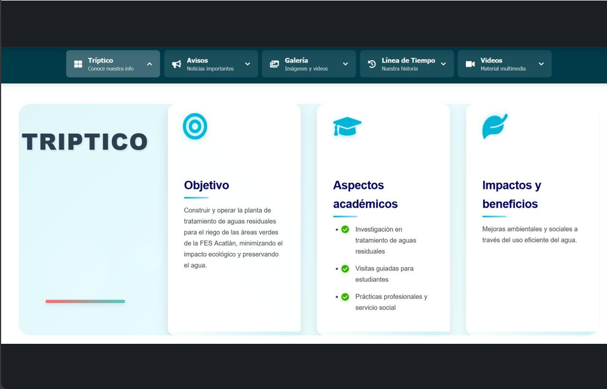

Codigo: https://github.com/venom-snake709/planta_agua

### Objetivos
- Plataforma de monitoreo para la Planta de Tratamiento de Aguas Residuales 
- Gráficas dinámicas y descarga de reportes en CSV
- Sistema de autenticación de usuarios integrado

### Herramientas
- SQLite
- Python/Django
- HTML,CSS, JS

