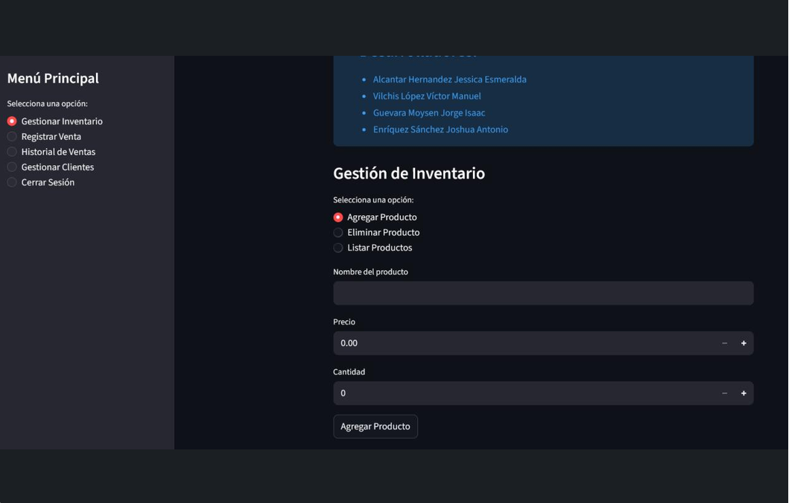

### Objetivos
- Autenticación con inicio y creación de sesión de usuarios
- Agendamiento de citas con calendario interactivo
- Registro y seguimiento de ventas

### Herramientas
- Python
- Streamlit
- SQLite
